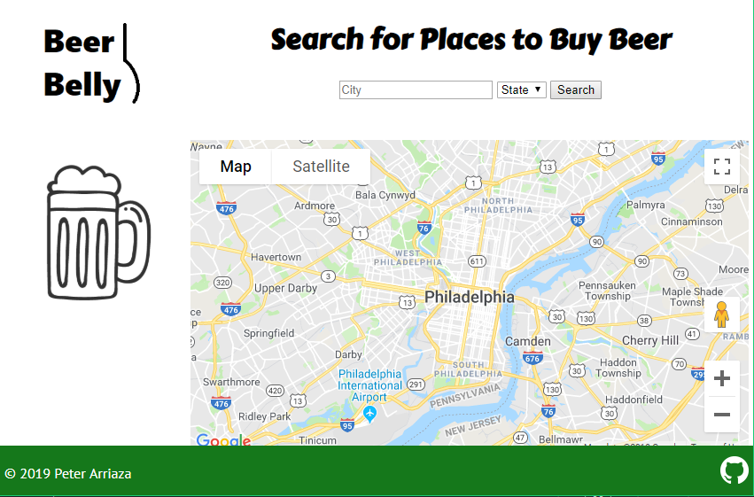
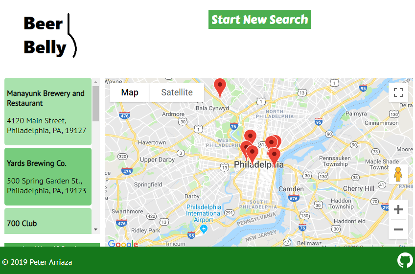
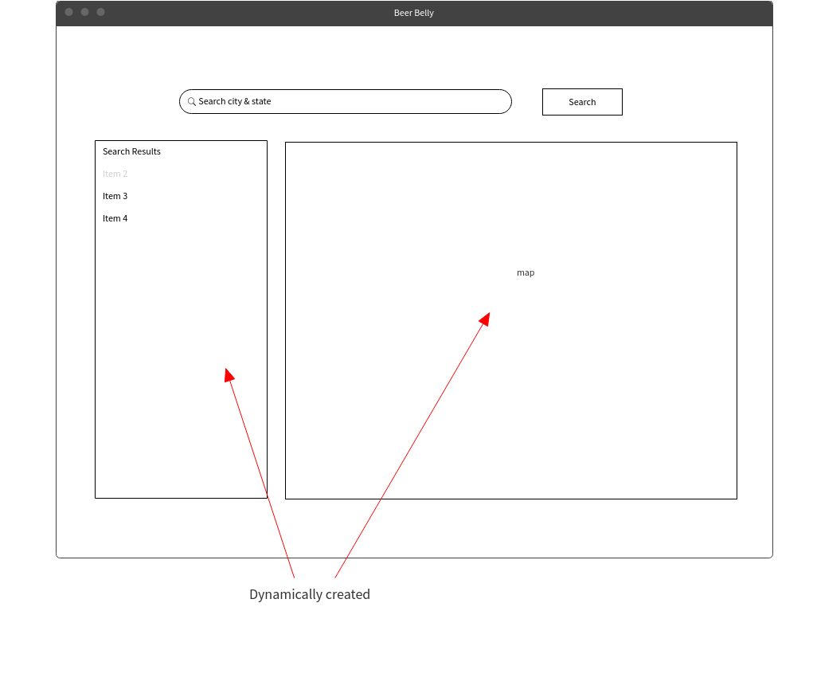
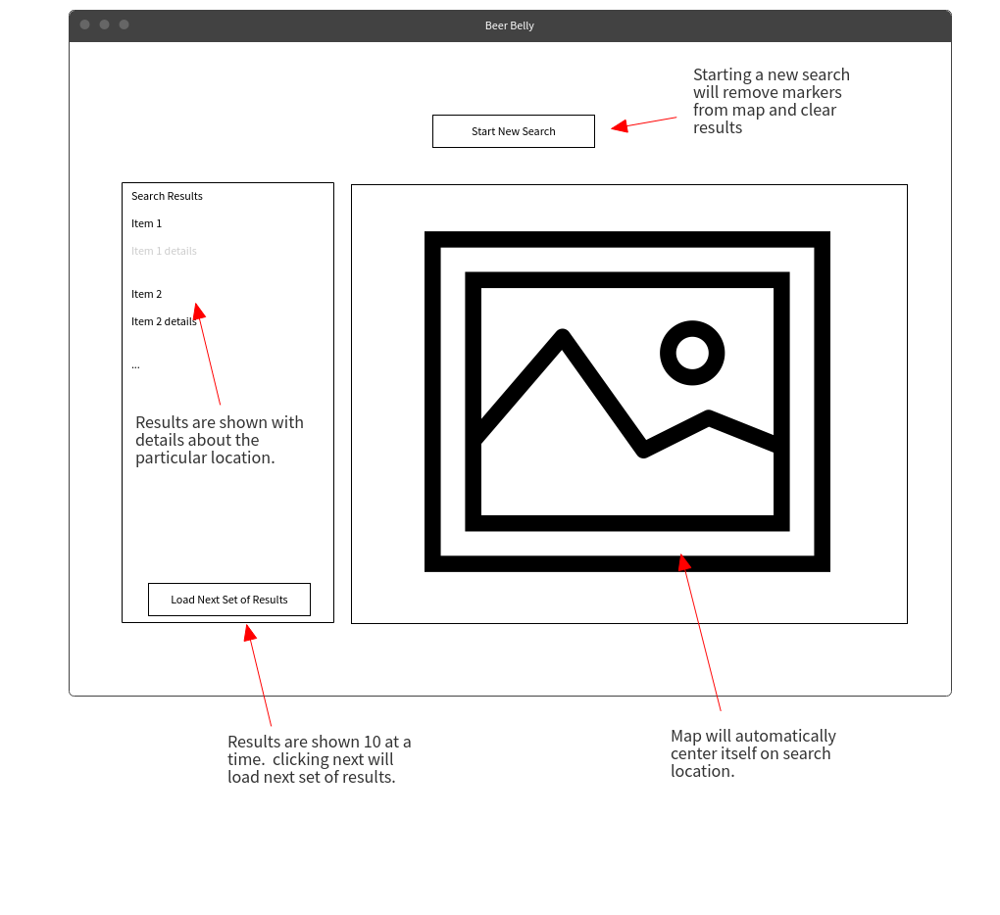

# BeerBelly

## About

A tasty little app to find local breweries, stores, bars, and other locations that sell beer.  Simply input the city and state that you'd like to search and start discovering new places to fulfill your ale your beer needs!

## How to Use

To start, enter a city followed by a state within the United States.  Both fields are required.  Display results in your search city by clicking "Search".

Results will be displayed 10 at a time.  Click a pin on the map to find out more about that location.  "Load Next 10 Results" will show more pins.  Clicking "Start New Search" will remove the placed pins and refresh the page.

## Under the Hood

This has been created for a Thinkful capstone project.  It implements the functionality using custom HTML, CSS, JavaScript, and JQuery with the Google Maps/Geocoding API.  Location data is provided by the [Beer Mapping Project API](https://beermapping.com "Beer Mapping Project"). 

## Live Link

You can view the project here: https://peterarriaza.github.io/BeerBelly/

## From Idea to Final Product

### Inspiration
A question I often ask myself when traveling is, "where can I find some beer?"  Putting aside my alcholic tendancies for a moment, a quick google search for "beer store" does not always turn up every result.  

So, I set out to create a resource to allow people to fill their Beer Bellies with fine beer from where they are or to plan out a trip in advance!

### Wireframes
The interface ideally should be simple.  Enter a location and see the results.  The first thing the user sees is a heading to search for places that sell beer. 

A location is input and then results show up. 

Once the location is submitted, the map will refresh with markers of each location.  The user can click on the marker to learn more about it.  To limit the amount of results shown at once (1000 results on a map at once would be overwhelming!), results are only shown in sets of 10.  

If the user wants to search for locations in a new destination, they can click "Start New Search" to refresh the page.

## Future Development

- Be able to navigate back and forth between results displays
- Search by current location
- Show more information about locations
- Save/favorite locations
- Link to Facebook, Untappd, or other social media platforms
- Write reviews of locations
- Enable users to create new locations

